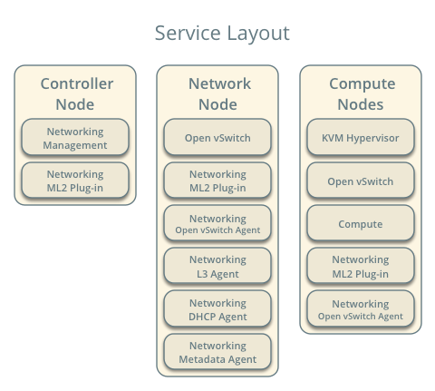
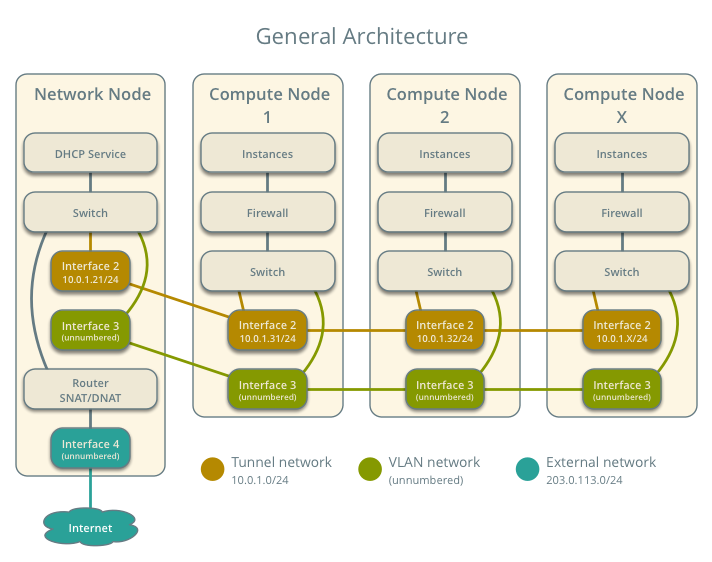

# Neutron Self-service networks 主機環境設定
Self-Service 的網路服務，可以讓部署多了 Layer 3（路由）服務的選擇，使用覆蓋網路分割租戶網路（Tanent Network），如 VXLAN、GRE。本質上它路由是使用 NAT 來讓虛擬網路對應到實體網路。此外夠能夠根據需求建置 Layer 7 的網路服務，如 LBaaS 與 FWaaS。Service Layout 如下圖所示。



目前典型部署架構是使用該網路模式，因為這個架構提供了 Layer 2 ~ 7 虛擬化網路元件。任何執行虛擬機網路的主機都會透過建立 Overlay 網路技術來讓 Network 節點進行流量的管理。再加上要考慮生產環境的單點故障、效能等淺在問題無法在 Provider network 模式解決，如部署 DVR 或 L3 HA 等。網路架構如下圖所示：



### 最小部署硬體規格分配
* **Controller Node**: 四核處理器, 8 GB 記憶體, 250 GB 儲存空間。
* **Network Node**: 雙核處理器, 4 GB 記憶體, 250 GB 儲存空間。
* **Compute Node**: 四核處理器, 8 GB 記憶體, 500 GB 儲存空間。

> `P.S.` 注意這邊作業系統採用 `Ubuntu 16.04 Server LTS `。

> `P.S.` 以上節點的 Linux OS 請採用 ```64``` 位元的版本，因為若是在 Compute 節點安裝 ```32``` 位元，在執行映像檔時，會出錯。

> 且每個節點儲存空間必須大於規格，若需要安裝其他服務，並分離儲存磁區時，請採用 ```Logical Volume Manager (LVM)```。

> 如果您選擇安裝在虛擬機上，請確認虛擬機是否允許混雜模式，並關閉 MAC 地址，在外部網絡上的過濾。

網路架構圖如下：


### 網路分配與說明
這邊安裝採用 ```Self-service networks``` 網通服務來提供虛擬化網路給虛擬機使用，本架構最小安裝情況下會使用各一台的 Controller、Network 以及 Compute 節點（可依服務需求增加），在不同節點上需要提供對映的多張網卡（NIC）來設定給不同網路使用：
* **Management（管理網路）**：10.0.0.0/24，需要一個 Gateway 並設定為 10.0.0.1。
> 這邊需要提供一個 Gateway 來提供給所有節點使用內部的私有網路，該網路必須能夠連接網際網路來讓主機進行套件安裝與更新等。

* **Tunnel（隧道網路）**：10.0.1.0/24，不需要 Gateway。
> 這邊主要 Compute 與 Network 節點建置 VXLAN 與 GRE 隧道網路，因此不需要提供 Gateway。

* **Public（公有網路）**：10.21.20.0/24，需要一個 Gateway 並設定為 10.21.20.254。
> 公有網路主要是提供外部網路給虛擬機使用，讓 Compute 節點可以透過隧道網路連接 Network 節點，並存取網際網路。注意，這邊要根據環境不同而改變。

這邊假設作業系統已經安裝完成，且已正常執行系統後，我們必須在每個節點準備以下設定。首先下面指令可以設定系統的 User 執行 root 權限時不需要密碼驗證：
```sh
$ echo "ubuntu ALL = (root) NOPASSWD:ALL" \
| sudo tee /etc/sudoers.d/ubuntu && sudo chmod 440 /etc/sudoers.d/ubuntu
```

以下指令可以列出所有網路裝置：
```sh
$ dmesg | grep -i network
$ ifconfig -a
```

若要設定 ubuntu 網卡的話，可以編輯```/etc/network/interfaces```，並新增如以下內容：
```
auto lo

auto eth0
iface eth0 inet static
        address 10.0.0.11
        netmask 255.255.255.0
        gateway 10.0.0.1
        dns-nameservers 8.8.8.8
```
> 若要改網卡名稱，可以編輯```/etc/udev/rules.d/70-persistent-net.rules```。

### Controller Node 設定
這邊將第一張網卡介面設定為 ```Management（管理網路）```：
* IP address：10.0.0.11
* Network mask：255.255.255.0 (or /24)
* Default gateway：10.0.0.1

完成上述後，請重新開機改變設定。

接著編輯```/etc/hostname```來改變主機名稱（Option）：
```sh
controller
```

最後並設定主機 IP 與名稱的對照，編輯```/etc/hosts```檔案加入以下內容：
```sh
10.0.0.11   controller
10.0.0.21   network
10.0.0.31   compute1
```
> P.S. 若有```127.0.1.1```存在的話，請將之註解掉，避免解析問題。

### Network node 設定
這邊將第一張網卡介面設定給```Management（管理網路）```使用：
* IP address: 10.0.0.21
* Network mask: 255.255.255.0 (or /24)
* Default gateway: 10.0.0.1

將第二張網卡介面設定給```Tunnel（隧道網路）```使用：
* IP address: 10.0.1.21
* Network mask: 255.255.255.0 (or /24)

將第三張網卡介面設定給```Public（公有網路）```使用。該網卡主要是提供虛擬機外部網路的流量出入口。這邊比較特殊，只需要設定手動啟動即可：
```sh
auto <INTERFACE_NAME>
iface <IINTERFACE_NAME> inet manual
        up ip link set dev $IFACE up
        down ip link set dev $IFACE down
```

完成上述後，請重新開機來改變設定。

接著編輯```/etc/hostname```來改變主機名稱（Option）：
```sh
network
```

最後並設定主機 IP 與名稱的對照，編輯```/etc/hosts```檔案加入以下內容：
```sh
10.0.0.11   controller
10.0.0.21   network
10.0.0.31   compute1
```
> P.S. 若有```127.0.1.1```存在的話，請將之註解掉，避免解析問題。

### Compute Node 設定
這邊將第一張網卡介面設定給```Management（管理網路）```使用：
* IP address: 10.0.0.31
* Network mask: 255.255.255.0 (or /24)
* Default gateway: 10.0.0.1

> 若有多個 Compute 節點，則 IP 也要跟著改變。

將第二張網卡介面設定給```Tunnel（隧道網路）```使用：
* IP address: 10.0.1.31
* Network mask: 255.255.255.0 (or /24)

> 若有多個 Compute 節點，則 IP 也要跟著改變。

完成上述後，請重新開機來改變設定。

接著編輯```/etc/hostname```來改變主機名稱（Option）：
```sh
compute1
```
> 其他節點以此類推

最後並設定主機 IP 與名稱的對照，編輯```/etc/hosts```檔案加入以下內容：
```sh
10.0.0.11   controller
10.0.0.21   network
10.0.0.31   compute1
```
> P.S. 若有```127.0.1.1```存在的話，請將之註解掉，避免解析問題。

## 主機設定驗證
完成上述設定後，我們要透過網路工具來測試節點之間網路是否有正常連接，首先在```Controller```節點上驗證其他節點，如以下方式：
```sh
$ ping -c 2 compute
PING compute (10.0.0.31) 56(84) bytes of data.
64 bytes from compute (10.0.0.31): icmp_seq=1 ttl=64 time=0.251 ms
64 bytes from compute (10.0.0.31): icmp_seq=2 ttl=64 time=0.253 ms

$ ping -c 2 8.8.8.8
PING 8.8.8.8 (8.8.8.8) 56(84) bytes of data.
64 bytes from 8.8.8.8: icmp_seq=1 ttl=44 time=16.1 ms
64 bytes from 8.8.8.8: icmp_seq=2 ttl=44 time=15.6 ms
```
> 其他節點以此類推測試。

上述沒問題後，到```Network```節點上驗證隧道網路與```Compute```節點有正常連接：
```sh
$ ping -c 2 10.0.1.31
PING 10.0.1.31 (10.0.1.31) 56(84) bytes of data.
64 bytes from 10.0.1.31: icmp_seq=1 ttl=64 time=0.222 ms
64 bytes from 10.0.1.31: icmp_seq=2 ttl=64 time=0.132 ms
```

最後確認```Network```節點三張網卡是否都已開啟。
